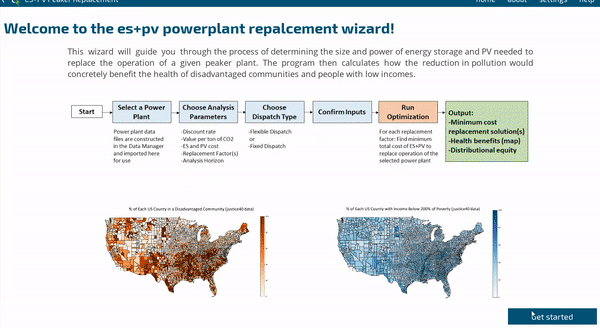

# snl-quest-equity


# QuESt Equity: Optimizing Energy Storage
[](https://travis-ci.com/rconcep/snl-quest)

Current release version: 1.0

Release date: July, 2023

## Contact
For issues and feedback we would appreciate it if you could use the "Issues" feature of this repository. This helps others join the discussion and helps us keep track of and document issues.

### Email
Entity account `@sandia.gov: snl-quest`

Project maintainer (David Rosewater) `@sandia.gov: dmrose`

## Table of contents
- [Introduction](#intro)
- [Getting started](#getting-started)
- [Frequently Asked Questions](#faq)
    - [QuESt Data Manager](#faq-data-manager)
    - [QuESt Equity](#faq-equity)

### What is it?
<a id="intro"></a>
QuESt is a a collection of open source, Python-based applications for energy storage simulation and analysis developed by the Energy Storage Systems program at Sandia National Laboratories, Albuquerque, NM. It is designed to give users access to models and analysis for energy storage used and developed by Sandia National Laboratories. It's designed to be transparent and easy to use without having to have knowledge of the mathematics behind the models or knowing how to develop code in Python. At the same time, because it is open source, users may modify it to suit their needs should they desire to. We will continue developing QuESt and its applications to enable more functionality.

#### QuESt Equity Data Manager
An application for acquiring data on powerplants pollution impacts, and demographic data from open sources. Data selected for download is acquired in a format and structure compatible with some other QuESt applications. Data that can be acquired in this application includes:
1. Powerplant "facility" data including location, capacity, hourly dispatch, and pollution. 
2. PV resource data at the location of the powerplant
3. Health impacts by county from the pollution produced by the powerplant
4. Limited demographics (% disadvantage and % low-income) by county of the area surrounding the powerplant

*Note: An internet connection is required to download data.*

*Note: Certain data sources require registering an account to obtain access.*

#### QuESt Equity

An application for assessing energy equity and environmental justice of energy storage projects. This application currently has the powerplant replacement wizard that estimates the health and climate benefits of substituting a powerplant with energy storage and PV. It then calculates the county level benefits to estimate how much the project would impact disadvantaged communities and people with low incomes.



### Who should use it?
The software is designed to be used by anyone with an interest in performing analysis of energy storage or its applications without having to create their own models or write their own code. It’s designed to be easy to use out of the box but also modifiable by the savvy user if they so choose. The software is intended to be used as a platform for running simulations, obtaining results, and using the information to inform planning decisions. 

## Getting started
<a id="getting-started"></a>

### Installing from executable (recommended)
Running QuESt Equity from an executable is the most straightforward way to get started with QuESt. You do not require any Python installation to install QuESt with this method; simply run the executable. What is required:

* QuESt executable package
* Solver compatible with Pyomo

We are currently looking into packaging a basic solver to simplify the installation process further.

#### Windows 10
You can find the executable version with each release in the [**Releases**](https://github.com/rconcep/snl-quest/releases) section.

1. Download and extract the `.zip` that is *not* labeled "Source code." Its name will be `snl-quest-v{version number}-win10.zip`.
2. Inside the extracted folder, there will be a lot of files and folders. Locate the `snl-quest-v{version number}.exe` file and run it.
3. A command prompt should open along with the QuESt GUI.

#### OSX, Linux
Currently, we do not offer executable packages of QuESt for OSX or Linux operating systems. They are possible to package but we have not implemented those packaging processes yet. Installing from source code is an option.

#### Solvers
When running the executable version of QuESt, a solver compatible for Pyomo is still required to be installed and on your system path. Please refer to the [solvers](#install-solvers) section for details.

### Installing from source code (advanced)
For all platforms, you can instead install QuESt using the codebase in this repository.

You will want to obtain the codebase for QuESt. You can do that by downloading a release version in a compressed archive from the "releases" tab on the GitHub repository page labeled as "Source code". Alternatively, you can clone this repository or download a compressed archive of it by clicking the "Clone or download" button on this page. We recommend keeping the QuESt files in a location where you have read/write permission. Once you have the codebase, follow the appropriate set of instructions for your operating system.

**Requirements**
* Python 3.6+
* Kivy 2.2.1+ and its dependencies
* Solver compatible with Pyomo

#### Windows
1. Install Python, preferably via scientific distribution such as [Anaconda](https://www.anaconda.com/download/). Use the 64 or 32-Bit Graphical installer as appropriate.
2. Install Kivy. Check [here](https://kivy.org/docs/installation/installation-windows.html) for the latest instructions. 
3. Navigate to the root directory of the codebase. Then run the setup
 ``python setup.py develop`` This will check dependencies for QuESt and install them as needed.
4. Install a solver for Pyomo to use. See other sections for instructions on this.
  
#### OSX
1. Install Python, preferably via scientific distribution such as [Anaconda](https://www.anaconda.com/download/). Use the 64 or 32-Bit Graphical installer as appropriate.
2. Install Kivy. Check [here](https://kivy.org/doc/stable/installation/installation-osx.html#using-homebrew-with-pip) for the latest instructions. (Refer to "Using Homebrew with pip" OR "Using MacPorts with pip")
3. Navigate to the root directory of the codebase. Then run the setup
 ``python setup.py develop`` This will check dependencies for QuESt and install them as needed.
4. Install a solver for Pyomo to use. See other sections for instructions on this.

### Solvers for Pyomo
<a id="install-solvers"></a>
At least one solver compatible with Pyomo is required to solve optimization problems. Currently, a solver capable of solving linear programs is required. GLPK and CBC are suggested options for freely available solvers. Note that this list is not meant to be exhaustive but contains the most common viable options that we have tested. 

#### Installing GLPK (for Windows)
1. Download and extract the executables for Windows linked [here](http://winglpk.sourceforge.net/).
2. The glpk_*.dll and glpsol.exe files are in the `w32` and `w64` subdirectories for 32-Bit and 64-Bit Windows, respectively. Select the pair for the appropriate version of Windows that you are using. You can place them in the same directory as the QuESt executable. 
   * Alternatively, you can place those files to the `C:\windows\system32` directory in order to have them in your system path. This will make GLPK available for the rest of your system instead of just for QuESt.
   * (When placing the files in your system path) Try running the command ``glpsol`` in the command prompt (Windows) or terminal (OSX). If you receive a message other than something like "command not found," it means the solver is successfully installed.

#### Installing GLPK (for Windows via Anaconda)
If you've installed Python using Anaconda, you may be able to install several solvers through Anaconda's package manager with the following (according to Pyomo's [installation instructions](https://pyomo.readthedocs.io/en/latest/installation.html)):

``conda install -c conda-forge glpk``

#### Installing GLPK (for OSX)
You will need to either build GLPK from source or install it using the [homebrew](https://brew.sh/) package manager. This [blog post](http://arnab-deka.com/posts/2010/02/installing-glpk-on-a-mac/) may be useful.

#### Installing GLPK or CBC (for OSX via Anaconda)
If you've installed Python using Anaconda, you may be able to install several solvers through Anaconda's package manager with the following (according to Pyomo's [installation instructions](https://pyomo.readthedocs.io/en/latest/installation.html)):

``conda install -c conda-forge glpk``

``conda install -c conda-forge coincbc``

#### Installing IPOPT (for Windows)
1. Download and extract the pre-compiled binaries linked [here](https://www.coin-or.org/download/binary/Ipopt/). Select the latest version appropriate for your system and OS.
2. Add the directory with the `ipopt.exe` executable file to your path system environment variable. For example, if you extracted the archive to `C:\ipopt`, then `C:\ipopt\bin` must be added to your path.
3. Try running the command ``ipopt`` in the command prompt (Windows) or terminal (OSX). If you receive a message other than something like "command not found," it means the solver is successfully installed.
Regardless of which solver(s) you install, remember to specify which of them to use in Settings within QuESt.

### Running QuESt Equity
If you are using the executable version, simply run the `snl-quest-v{version number}.exe` file.

If you are running from the codebase, from the Anaconda Prompt or Command Prompt, run:
```
python main.py
```

Alternatively, run ```main.py``` in a Python IDE of your choice.

**NOTE: The current working directory must be where ``main.py`` is located (the root of the repository).**

### Updating QuESt
#### Installed from executable
Download and extract the executable package as previously. You can copy over your `\data\` directory to transfer your data bank to the new version. You can also copy over your `\quest.ini` file to migrate your QuESt settings as well.

#### Installed from source code
If you cloned the GitHub repository, you can execute a `git pull` command in the terminal/cmd while in the root of the QuESt directory. If you haven't modified any source code, there should be no conflicts. The master branch of the repository is reserved for release versions and is the most stable.

If you downloaded an archive of the master branch, you can download the latest release version as if it were a fresh install. You can drag and drop your old data directory so that you do not have to download all the data again if you would like. You can also move your `/quest.ini` file to migrate your settings.

## Frequently Asked Questions
<a id="faq"></a>

### General

> I am getting import errors when trying to run QuESt.

The current working directory must be where ``main.py`` is located.

> The appearance of GUI elements in QuESt do not appear correct/The window does not display properly/The window is too big for my display/I cannot click or interact with the UI properly.

QuESt is designed to be displayed at minimum resolution of 1600x900.

There are a number of possible reasons for display issues, but the most likely reason is due to operating system scaling. For example, Windows 10 has a feature that scales the appearance of display elements, usually to assist with higher resolution displays. For example, if scaling is set to 125% in Windows, this will scale the QuESt window to be too big for the display (on a 1920x1080 resolution display).

Scaling may also have the effect of confusing Kivy of where a UI element is and where it is displayed; e.g., you may be clicking where a button appears to be, but the scaling causes Kivy to not "detect" that you are pressing the button.

So far, this issue has been observed on a variety of laptops of both Windows and OSX varieties. Our suggestion is to disable OS level scaling or to connect to an external display and try to launch QuESt on it.

> Are there any help tutorials/manuals/etc. for QuESt?

We strive to make QuESt as lightweight and intuitive to use as possible through its design. In version 1.0, we integrated additional help carousels within QuESt to provide additional details throughout the software. We currently do not intend to make a comprehensive manual but may share presentation materials such as mini tutorials that may be of interest.

> I want to know more about how the algorithms work/how the results are computed.

Please see the [references](#references) for relevant publications describing the models that were implemented into QuESt. As we further develop the API and documentation, we will aggregate formulation details in those documents.

> I'm interested in a tool/capability that is not currently in QuESt.

Feel free to drop us a line! User feedback helps shape our development goals and priorities and we would welcome hearing what users would like to have.

### QuESt Data Manager
<a id="faq-data-manager"></a>

> I am connecting to the internet through a proxy, such as on a corporate network. How should I configure my connection settings?

Typically, devices have their connection settings configured for the network they will primarily residing on. For example, proxy settings may already be configured in system environment variables and whatnot. We recommend that your proxy settings be configured at the operating system level and that you do not additionally specify using a proxy in QuESt settings. In our experience, additionally specifying the same proxy settings in QuESt "does no harm," but your mileage may vary.

> I am trying to download data and am receiving many messages about connection errors, timeouts, etc. What should I do?

We found these issues to be very network dependent and hard to diagnose or mitigate against. The best practice would be to limit the amount of data that you request at a time. Additionally, QuESt Data Manager is configured to skip data that is already downloaded so you can just issue the same request to patch up any data that may have failed to download.

> I downloaded data but other QuESt applications are telling me that I haven't downloaded any.

QuESt expects data to be in a certain directory structure as structured by QuESt Data Manager. Changing directory names, filenames, modifying files, etc. will produce unexpected results. We recommend not performing any modifications to downloaded data files except for perhaps deleting them.

> Why does it take so long to download data?

* Some download requests are requesting large amounts of data.
* Some EPA websites or APIs have connection issues. We incorporate mechanisms for automatically retrying a limited amount of times.

> How do I obtain an API key for Data.gov / OpenEI / utility rate structure database / PVWatts / PV profile data?

Refer to the instructions in QuESt Data Manager or see the signup form [here](https://developer.nrel.gov/signup/). The API key is the same for all those applications.

> I want to know more about how the PV power profiles are simulated.

See the API description and PVWatts manual [here](https://developer.nrel.gov/docs/solar/pvwatts/v6/).

> I try to download data for a powerplant and get "An error has occurred with the COBRA API."

This can occur if you are requesting data for a powerplant outside of the continental U.S. or if there is some issue with the FIPS code for the county (e.g., it applies to a city instead of a county). We are working on correcting this kind of error but there is no fix at this time. 

### QuESt Equity
<a id="faq-equity"></a>

> Can I adjust the powerplant parameters in the wizard?

No, any adjustments must be made in QuESt Data Manager before saving the entire powerplant data file. It is posible to edit the JSON data file directly under `/data/power_plant/`.

> Can I use a PV profile separate from what the QuESt Data Manager downloads automatically for the powerplant?

Yes. You need to normalize the hourly power prodution data to the range [0,1] and then open the powerplant data file and replace the parameter "pv" with the new normalized profile. The wizard will then use the new profile when that powerplant data file is selected.

> When I select more than three replacement fractions the figures don't display correctly and I can't read the labels.

This is a known issue. The output file (labeled outputfile.json) can be found in `/results/equity/YYYY_MM_DD_HHMMSS/` and has all of the results stored so that they can be plotted correctly through another program. 

#### powerplant data and dispatch profile
The powerplant data files are stored as .json files in `/data/power_plant/` after being downloaded through QuESt Data Manager. You can add a new file following the format of one downloaded using QuESt Data Manager. 

The format has the plant medidata stored by parameter name. For example {"Name": "Calpine Hidalgo Energy Center",}. The parameter "plant_dispatch" has an hourly dispatch for 1 year in MW stored as a list of floating points [1,2,3,4,5,6 ...], while the parameter "pv" has a similar list of available PV resource but it is normalized to the range [0,1] on a per MW basis. The "COBRA_results" parameter stores the county level "Impacts" and a "Summary" of the total impacts across the country. The "health_impact_equity" parameter has data calculated by cross-referencing the "COBRA_results" with census data for each county. Classification as a disadvantaged communities is done by census tract so the population fraction of a county living in a disadvantaged community is calculated by the total population of census tracts within a county that are considered disadvantaged divided by the total population of the county. 

Once new files are added to the `data` bank appropriately, they should be picked up in the relevant applications when you are prompted to make a selection.

## References
<a id="references"></a>
Nguyen, Tu A., David A. Copp, and Raymond H. Byrne. "Stacking Revenue of Energy Storage System from Resilience, T&D Deferral and Arbitrage." 2019 IEEE Power & Energy Society General Meeting (PESGM). IEEE, 2019.

Byrne, Raymond H., Tu A. Nguyen, and Ricky J. Concepcion. "Opportunities for Energy Storage in CAISO." 2018 IEEE Power & Energy Society General Meeting (PESGM). IEEE, 2018.
[Available online](https://www.osti.gov/servlets/purl/1489129).

Byrne, Raymond H., Tu Anh Nguyen, and Ricky James Concepcion. Opportunities for Energy Storage in CAISO. No. SAND2018-5272C. Sandia National Lab.(SNL-NM), Albuquerque, NM (United States), 2018.
[Available online](https://www.osti.gov/servlets/purl/1515132).

Concepcion, Ricky J., Felipe Wilches-Bernal, and Raymond H. Byrne. "Revenue Opportunities for Electric Storage Resources in the Southwest Power Pool Integrated Marketplace." 2018 IEEE Power & Energy Society General Meeting (PESGM). IEEE, 2018.
[Available online](https://www.osti.gov/servlets/purl/1574578).

Wilches-Bernal, Felipe, Ricky J. Concepcion, and Raymond H. Byrne. "Electrical Energy Storage Participation in the NYISO Electricity and Frequency Regulation Markets." 2018 IEEE Power & Energy Society General Meeting (PESGM). IEEE, 2018.

Nguyen, Tu A., and Raymond H. Byrne. "Maximizing the cost-savings for time-of-use and net-metering customers using behind-the-meter energy storage systems." 2017 North American Power Symposium (NAPS). IEEE, 2017.
[Available online](https://www.osti.gov/servlets/purl/1431654).

Nguyen, Tu A., et al. "Maximizing revenue from electrical energy storage in MISO energy & frequency regulation markets." 2017 IEEE Power & Energy Society General Meeting. IEEE, 2017.
[Available online](https://www.osti.gov/servlets/purl/1408956).

Byrne, Raymond H., Ricky J. Concepcion, and César A. Silva-Monroy. "Estimating potential revenue from electrical energy storage in PJM." 2016 IEEE Power and Energy Society General Meeting (PESGM). IEEE, 2016.
[Available online](https://www.osti.gov/servlets/purl/1239334).

Byrne, Raymond H., et al. "The value proposition for energy storage at the Sterling Municipal Light Department." 2017 IEEE Power & Energy Society General Meeting. IEEE, 2017.
[Available online](https://www.osti.gov/servlets/purl/1427423).

Byrne, Raymond H., et al. "Energy management and optimization methods for grid energy storage systems." IEEE Access 6 (2017): 13231-13260.
[Available online](https://ieeexplore.ieee.org/abstract/document/8016321).

Byrne, Raymond H., and César A. Silva-Monroy. "Potential revenue from electrical energy storage in ERCOT: The impact of location and recent trends." 2015 IEEE Power & Energy Society General Meeting. IEEE, 2015.
[Available online](https://www.osti.gov/servlets/purl/1244909).
